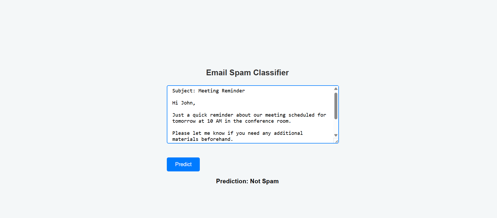

# ✉️ Email Spam Classifier using Logistic Regression

This is a web-based Email Spam Classifier built using **Flask** and trained with a **Logistic Regression** model. The model uses a bag-of-words approach to analyze the frequency of words in emails and classify them as either **Spam** or **Not Spam**.

---

## 🧠 Features

- Trained Logistic Regression model on custom email word-frequency dataset
- Flask web interface for user input
- Real-time spam prediction
- Clean, styled UI using custom CSS
- Screenshot support and model deployment ready

---

## 📸 Screenshots

### 🔷 Prediction Example 1



### 🔷 Prediction Example 2


---

## ⚙️ Tech Stack

- **Python** (Logistic Regression, pandas, sklearn)
- **Flask** (web framework)
- **HTML/CSS** (UI layout & styling)
- **Pickle** (for model serialization)

---

## 📁 Project Structure


```plaintext
email-spam-classifier/
│
├── models/
│   ├── logreg_model.pkl          # Trained Logistic Regression model
│   └── vocabulary.pkl            # Vocabulary used during training
│
├── notebooks/
│   └── email-spam-classifier.ipynb  # Jupyter Notebook for training and experimentation
│
├── static/
│   └── style.css                # CSS styling for the web interface
│
├── templates/
│   └── index.html               # HTML template for Flask frontend
│
├── app.py                       # Flask application script
├── email.csv                    # Dataset in bag-of-words format
├── README.md                    # Project documentation
├── screenshot1.png              # UI Screenshot 1
└── screenshot2.png              # UI Screenshot 2
```


---

## 🚀 How to Run Locally

1. Clone this repo:
   git clone https://github.com/suhanakesharwani/email-spam-classifier.git
   cd email-spam-classifier

2. Install dependencies:
    pip install flask scikit-learn pandas

3. Run the Flask app:
    python app.py

4. Open http://127.0.0.1:5000 in your browser
